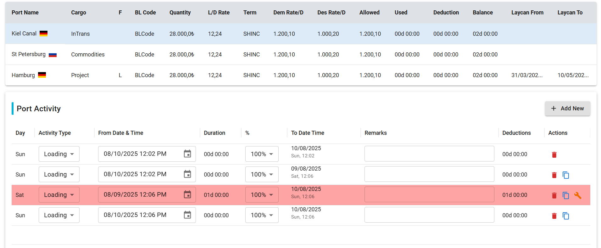

# Next.js v15 App with Material-UI (MUI)
## Download

[⬇️ Download Task Overview](./src/asset/images/task (1).txt)
## Description

This is a modern web application built with **Next.js v15** using the new **app router** feature, combined with **Material-UI (MUI)** for sleek and responsive UI components.

## Demo



## Features

- Next.js v15 app router architecture
- Responsive and accessible UI built with Material-UI v5
- Server-side rendering and static generation
- Clean and scalable folder structure using `/app` directory

## Tech Stack

- Next.js v15
- React 19
- Material-UI (MUI) v5

## Installation

Clone or download the repository and install its dependencies:

## Production Mode

```bash
npm run build
npm run start
# or
yarn build
yarn start
# or
pnpm build
pnpm start
# or
bun build
bun start
```

## Development Mode

```bash
npm run dev
# or
yarn dev
# or
pnpm dev
# or
bun dev
```
